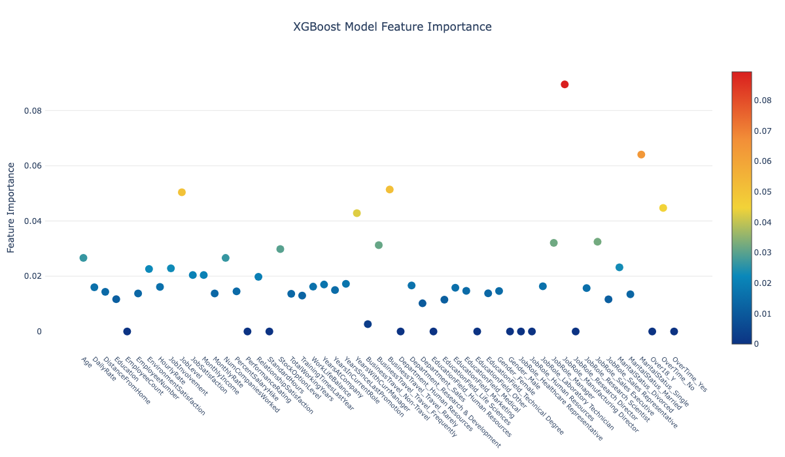

# XGBoost Classification - Employee Attrition Prediction

XGBoost is an efficient and high-performing algorithm for supervised machine learning tasks, especially suited for classification and regression. It utilizes gradient boosting techniques, which make it powerful for handling unstructured data, ensuring regularization, and mitigating overfitting. Its flexibility and scalability have made it a go-to choice for a wide variety of predictive tasks in both structured and unstructured environments.

## Problem Overview
In this project, we tackle an employee attrition prediction problem. Employee attrition is a critical issue for organizations as it involves understanding which employees are likely to leave, and what factors influence this decision. Predicting attrition can help organizations proactively address issues, potentially reducing turnover costs and enhancing retention strategies. Here, we use an XGBoost model to classify whether an employee will stay or leave, based on factors like work environment, job role, and personal details.

## Project Summary
We perform a range of data preprocessing and exploratory data analysis steps, and then train an XGBoost model. After an initial round of model training, we improve performance through hyperparameter tuning (HPT). This optimization process led to a noticeable increase in accuracy:

- **Initial Model Accuracy**: 87.5%
- **Post-Hyperparameter Tuning Accuracy**: 88.3%

Key steps include:
1. **Data Preprocessing**: Handle categorical encoding, missing values, and scaling as required.
2. **Exploratory Data Analysis**: Generate insights from features and correlations within the dataset.
3. **Model Training**: Implement an XGBoost classifier and evaluate initial performance.
4. **Hyperparameter Tuning**: Use RandomizedSearchCV to tune parameters and improve model accuracy.
5. **Feature Importance Analysis**: Analyze which features are most significant in predicting employee attrition.

This notebook provides a comprehensive guide to predicting employee attrition with a high degree of accuracy, aiding companies in proactive decision-making.

## Requirements
- Python 3.7+
- XGBoost
- Pandas
- Scikit-Learn
- Imbalanced-learn for SMOTE

## Running the Code
To replicate this analysis:
1. Clone the repository.
2. Install required libraries using:
   ```shell
   pip install -r requirements.txt
   

